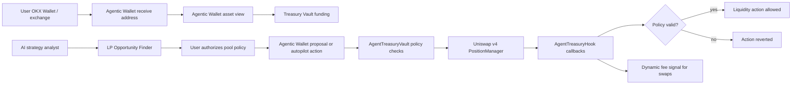

# AI Agent Treasury Hook

AI Agent Treasury Hook is an X Layer + Uniswap v4 project where a user funds an OKX Agentic Wallet, the Agentic Wallet manages treasury assets, and a Hook enforces the user's risk limits whenever liquidity is added, removed, or rebalanced.

This version is ready for GitHub testing. X Layer deployment, demo video recording, and hackathon submission still require owner approval before final submission.

## Why This Hook Exists

Most v4 hackathon entries improve a swap path: dynamic fee, limit order, TWAP, or routing. This project is different. It creates an Agent-native treasury flow:

1. The user connects only OKX Agentic Wallet through the local bridge.
2. The user funds the Agentic Wallet receive address from OKX Wallet, an exchange, or another wallet.
3. The app displays Agentic Wallet assets on X Layer so the user can decide what can be used.
4. The Agent ranks LP opportunities by fee APR, TVL, volume, volatility, and concentration risk.
5. The user authorizes one selected pool with hard limits: max capital, min range width, daily action count, strategy mode, and manual/autopilot mode.
6. Agentic Wallet executes approve/deposit/authorize/proposal actions only after local safety scan and user-controlled write mode.
7. The Hook enforces those limits inside Uniswap v4 liquidity callbacks.

The Agent does not get open-ended custody. It receives bounded authority over selected pools only, and the user's assets sit in Agentic Wallet first.

## Agent Model And Hook Strategy

The MVP does not require an LLM to move money. The LLM is an offchain strategy analyst: it explains opportunities, ranks candidate pools, and writes proposal rationales. The money-moving logic is deterministic.

The Hook strategy is not "AI says yes." It is a hard onchain rule system:

- pool allowlist by `poolId`,
- max capital basis points,
- minimum LP range width,
- max daily actions,
- unique `actionId` replay protection,
- manual/autopilot mode from the Vault policy,
- dynamic fee signal from the authorized reporter.

That split is intentional: the Agent can be smart offchain, but execution is constrained onchain.

## Product Flow



## What Is Implemented

- `AgentTreasuryHook`: Uniswap v4 Hook with `afterInitialize`, `beforeAddLiquidity`, `beforeRemoveLiquidity`, `beforeSwap`, and `afterSwap`.
- `AgentTreasuryVault`: user-owned vault that stores pool policies, deposits, withdrawals, proposals, daily action limits, and allowed execution targets.
- Hook-level LP guard: liquidity actions carrying Agent hook data must match an authorized pool policy, use a unique action id, respect capital caps, respect minimum range width, and consume the daily action quota.
- Opportunity signal reporting: the signal reporter can publish risk scores and fee overrides for selected pools.
- Dynamic fee support: swaps use a reported fee override or fall back to low/high risk fees.
- OKX-style guided app: Chinese/English language switch, Agentic Wallet connect/disconnect menu, receive address copy, Agentic Wallet OKB/ERC20 asset display, asset picker with imported-token support, LP strategy selection, prepared approve/deposit/authorize/proposal/signal actions, safety scan, and proof log.
- Agentic Wallet bridge: `npm run agentic:bridge` exposes local wallet status, X Layer address, and balance data. It is read/scan-only by default; write mode requires `AGENTIC_BRIDGE_WRITE=1`.
- Foundry deployment scripts for demo tokens, Hook, Treasury Vault, pool creation/liquidity, swaps, and demo router.
- Foundry tests covering manual liquidity, dynamic fee signals, authorized Agent LP actions, capital cap rejection, replay protection, narrow-range rejection, and daily action limits.

## Repository Structure

```text
xlayer-agentic-intent-hook/
├── app/                         # React operator console
├── src/
│   ├── AgentTreasuryHook.sol     # Uniswap v4 Hook
│   ├── AgentTreasuryVault.sol    # User-owned Agent LP treasury
│   └── MockAgentToken.sol        # Demo ERC-20 pair
├── script/                      # Foundry deployment and operation scripts
├── scripts/
│   └── agentic-wallet-bridge.mjs # Local Agentic Wallet status/balance/scan bridge
├── test/                        # Foundry tests
├── deployment/                  # Local review manifest
├── docs/                        # Chinese review notes
└── SUBMISSION.md                # Hackathon submission draft
```

## Core Files

- `src/AgentTreasuryHook.sol` - Hook policy enforcement and dynamic fee signals.
- `src/AgentTreasuryVault.sol` - user treasury, pool authorization, deposits, proposals, and daily action controls.
- `app/src/App.tsx` - Agentic Wallet-only OKX-style product console.
- `app/src/treasury.ts` - pool key, pool id, opportunity scoring, action id, and explorer helpers.
- `scripts/agentic-wallet-bridge.mjs` - local bridge to Agentic Wallet CLI status, balances, tx-scan, and optional contract-call.
- `test/AgentTreasuryHook.t.sol` - full local behavior tests.
- `script/00_DeployHook.s.sol` - mines and deploys the permission-encoded Hook address.
- `script/03_DeployAgentTreasury.s.sol` - deploys the user-owned Treasury Vault.

## X Layer Configuration

- Chain ID: `196`
- RPC: `https://rpc.xlayer.tech` or `https://xlayerrpc.okx.com`
- Explorer: `https://www.okx.com/web3/explorer/xlayer`
- Native gas token: `OKB`
- PoolManager: `0x360E68faCcca8cA495c1B759Fd9EEe466db9FB32`
- PositionManager: `0xcF1EAFC6928dC385A342E7C6491d371d2871458b`
- Permit2: `0x000000000022D473030F116dDEE9F6B43aC78BA3`

## Local Verification

```bash
npm install
npm run typecheck
npm run build
forge test
```

Expected:

```text
TypeScript passes
Vite build succeeds
Foundry tests pass
```

Run the app:

```bash
npm run dev
```

Start the Agentic Wallet bridge:

```bash
npm run agentic:bridge
```

Open the local Vite URL. The app does not connect to an injected browser wallet. The bridge listens on `127.0.0.1:8789` and shows the Agentic Wallet address and funds.

Write mode is intentionally off by default. For real contract calls after owner approval:

```bash
AGENTIC_BRIDGE_WRITE=1 npm run agentic:bridge
```

## X Layer Deployment Runbook

Create `.env`:

```bash
cp .env.example .env
```

Fill the owner-approved values, then deploy in this order:

```bash
source .env
forge script script/00_DeployDemoTokens.s.sol --rpc-url "$X_LAYER_RPC_URL" --account "$FOUNDRY_ACCOUNT" --sender "$DEPLOYER_ADDRESS" --broadcast
```

```bash
SIGNAL_REPORTER="$SIGNAL_REPORTER" \
forge script script/00_DeployHook.s.sol --rpc-url "$X_LAYER_RPC_URL" --account "$FOUNDRY_ACCOUNT" --sender "$DEPLOYER_ADDRESS" --broadcast
```

```bash
HOOK_ADDRESS="$HOOK_ADDRESS" TREASURY_OWNER="$TREASURY_OWNER" AGENT_ADDRESS="$AGENT_ADDRESS" \
forge script script/03_DeployAgentTreasury.s.sol --rpc-url "$X_LAYER_RPC_URL" --account "$FOUNDRY_ACCOUNT" --sender "$DEPLOYER_ADDRESS" --broadcast
```

```bash
TOKEN0="$TOKEN0" TOKEN1="$TOKEN1" HOOK_ADDRESS="$HOOK_ADDRESS" \
forge script script/01_CreatePoolAndAddLiquidity.s.sol --rpc-url "$X_LAYER_RPC_URL" --account "$FOUNDRY_ACCOUNT" --sender "$DEPLOYER_ADDRESS" --broadcast
```

Then use the app to:

- connect Agentic Wallet through the bridge,
- copy the Agentic Wallet receive address and fund it with tiny test assets,
- verify the Agentic Wallet funds panel,
- choose a usable Agentic Wallet asset from the asset menu,
- prepare ERC20 approve and Vault deposit actions,
- run security scan before each prepared action,
- execute through Agentic Wallet only after owner-approved write mode,
- authorize one LP strategy,
- prepare and scan the Hook signal action,
- prepare and scan the Agent proposal action,
- fill all transaction hashes into `deployment/xlayer-mainnet.review.json`.

## Security Boundaries

- The app never connects to a browser injected wallet.
- The Agentic Wallet bridge is read/scan-only by default and never signs or broadcasts unless `AGENTIC_BRIDGE_WRITE=1` is explicitly set.
- The app does not ask for seed phrases or private keys.
- Use Foundry keystore `--account`; avoid raw private keys in shell history.
- Real Agentic Wallet `contract-call` runs must follow the safety scan and confirmation flow first.
- Use tiny demo token amounts for the first proof.
- Agent authority is pool-scoped and policy-limited.
- Owner can pause the vault, update the Agent, update the Hook, and withdraw funds.
- Manual approval is the default app mode. Autopilot is only enabled when the owner explicitly disables manual approval for an authorized opportunity.

## Judge Proof Checklist

- Hook contract address on X Layer.
- Treasury Vault contract address.
- Agentic Wallet / Agent address used for the demo.
- Demo token pair addresses.
- Pool initialize transaction with dynamic fee and Hook address.
- Treasury funding transactions.
- Pool authorization transaction.
- Hook signal transaction.
- Agent proposal transaction.
- Liquidity action transaction showing Hook callback enforcement.
- App screenshot/video showing Agentic Wallet connection, funds display, opportunity selection, prepared/scanned actions, authorization, and proof log.
