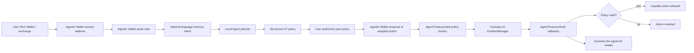

# AI Agent Treasury Hook

AI Agent Treasury Hook is an X Layer + Uniswap v4 project where a user gives an Agent a natural-language LP treasury goal, OKX Agentic Wallet executes the resulting plan, and a Hook enforces the user's risk limits whenever liquidity is added, removed, or rebalanced.

This version includes live X Layer mainnet proof. Demo video recording, final X post, and the hackathon submission form still require owner approval before final submission.

Fast proof links:

- Judge guide: [`docs/JUDGE_GUIDE.md`](docs/JUDGE_GUIDE.md)
- Deployment manifest: [`deployment/xlayer-mainnet.review.json`](deployment/xlayer-mainnet.review.json)
- Local Agentic Wallet proof: `npm run proof:agentic`
- Live chain proof: `npm run verify:live`

## Why This Hook Exists

Most v4 hackathon entries improve a swap path: dynamic fee, limit order, TWAP, or routing. This project is different. It creates an Agent-native treasury flow:

1. The user signs in to OKX Agentic Wallet with email OTP through the Agent Gateway.
2. The gateway calls OKX OnchainOS / Agentic Wallet services; it is not a separate wallet server and never holds private keys.
3. The user funds the Agentic Wallet receive address from OKX Wallet, an exchange, or another wallet.
4. The app displays Agentic Wallet assets on X Layer so the user can decide what can be used.
5. The user describes a treasury goal in the Agent chat, for example: "low-risk gFLOW/aiUSD LP, max 30% capital, max 3 rebalances per day."
6. The local Agent planner turns that sentence into a structured pool policy and execution path.
7. The user authorizes one selected pool with hard limits: max capital, min range width, daily action count, strategy mode, and manual/autopilot mode.
8. Agentic Wallet executes approve/deposit/authorize/proposal actions only after safety scan and user-controlled write mode.
9. The Hook enforces those limits inside Uniswap v4 liquidity callbacks.

The Agent does not get open-ended custody. It receives bounded authority over selected pools only, and the user's assets sit in Agentic Wallet first.

## Agent Model And Hook Strategy

The MVP does not require an LLM to move money. The LLM is an offchain strategy analyst: it explains opportunities, ranks candidate pools, and writes proposal rationales. The money-moving logic is deterministic.

The Hook strategy is not "AI says yes." It is a hard onchain rule system:

- pool allowlist by `poolId`,
- max capital basis points,
- minimum LP range width,
- max daily actions,
- unique `actionId` replay protection,
- manual/autopilot mode from the Vault policy,
- dynamic fee signal from the authorized reporter.

That split is intentional: the Agent can be smart offchain, but execution is constrained onchain.

## Product Flow



## What Is Implemented

- `AgentTreasuryHook`: Uniswap v4 Hook with `afterInitialize`, `beforeAddLiquidity`, `beforeRemoveLiquidity`, `beforeSwap`, and `afterSwap`.
- `AgentTreasuryVault`: user-owned vault that stores pool policies, deposits, withdrawals, proposals, daily action limits, and allowed execution targets.
- Hook-level LP guard: liquidity actions carrying Agent hook data must match an authorized pool policy, use a unique action id, respect capital caps, respect minimum range width, and consume the daily action quota.
- Opportunity signal reporting: the signal reporter can publish risk scores and fee overrides for selected pools.
- Dynamic fee support: swaps use a reported fee override or fall back to low/high risk fees.
- Conversational Agent app: Chinese/English language switch, natural-language treasury intent input, deterministic local Agent planner, structured LP policy card, execution path, live proof ledger, and advanced execution controls hidden by default.
- Agentic Wallet gateway: `npm run agentic:bridge` can run locally or on a server. It supports per-user email OTP login, isolated Agentic Wallet sessions, X Layer balance data, `/agent/plan`, `/proof/live`, safety scans, and optional write mode. Write mode requires `AGENTIC_BRIDGE_WRITE=1`.
- Foundry deployment scripts for demo tokens, Hook, Treasury Vault, pool creation/liquidity, swaps, and demo router.
- Foundry tests covering manual liquidity, dynamic fee signals, authorized Agent LP actions, capital cap rejection, replay protection, narrow-range rejection, and daily action limits.

## Repository Structure

```text
xlayer-agentic-intent-hook/
├── app/                         # React conversational Agent console
├── src/
│   ├── AgentTreasuryHook.sol     # Uniswap v4 Hook
│   ├── AgentTreasuryVault.sol    # User-owned Agent LP treasury
│   └── MockAgentToken.sol        # Demo ERC-20 pair
├── script/                      # Foundry deployment and operation scripts
├── scripts/
│   └── agentic-wallet-bridge.mjs # Agentic Wallet gateway
├── test/                        # Foundry tests
├── deployment/                  # Local review manifest
├── docs/                        # Chinese review notes
└── SUBMISSION.md                # Hackathon submission draft
```

## Core Files

- `src/AgentTreasuryHook.sol` - Hook policy enforcement and dynamic fee signals.
- `src/AgentTreasuryVault.sol` - user treasury, pool authorization, deposits, proposals, and daily action controls.
- `app/src/App.tsx` - conversational Agent treasury UI, plan card, proof ledger, and advanced execution controls.
- `app/src/proof.ts` - public live proof data shown in the app.
- `app/src/treasury.ts` - pool key, pool id, opportunity scoring, action id, and explorer helpers.
- `scripts/agentic-wallet-bridge.mjs` - Agentic Wallet gateway for login, balances, tx-scan, and optional contract-call.
- `test/AgentTreasuryHook.t.sol` - full local behavior tests.
- `script/00_DeployHook.s.sol` - mines and deploys the permission-encoded Hook address.
- `script/03_DeployAgentTreasury.s.sol` - deploys the user-owned Treasury Vault.

## X Layer Configuration

- Chain ID: `196`
- RPC: `https://rpc.xlayer.tech` or `https://xlayerrpc.okx.com`
- Explorer: `https://www.okx.com/web3/explorer/xlayer`
- Native gas token: `OKB`
- PoolManager: `0x360E68faCcca8cA495c1B759Fd9EEe466db9FB32`
- PositionManager: `0xcF1EAFC6928dC385A342E7C6491d371d2871458b`
- Permit2: `0x000000000022D473030F116dDEE9F6B43aC78BA3`

## Live X Layer Proof

Deployed on X Layer mainnet, chain `196`. Full proof data is in [`deployment/xlayer-mainnet.review.json`](deployment/xlayer-mainnet.review.json).

| Artifact | Address / tx |
| --- | --- |
| `AgentTreasuryHook` | [`0x0399aa2C8e39aAC071A5ce36ef4a6502492A1aC0`](https://www.okx.com/web3/explorer/xlayer/address/0x0399aa2C8e39aAC071A5ce36ef4a6502492A1aC0) |
| `AgentTreasuryVault` | [`0x4CE73a41011B8C24A970BD6728C30090CF82f5a5`](https://www.okx.com/web3/explorer/xlayer/address/0x4CE73a41011B8C24A970BD6728C30090CF82f5a5) |
| Token0 `gFLOW` | [`0x776bFCc40Fb3d226008e9E673F80bbbaD60a6B82`](https://www.okx.com/web3/explorer/xlayer/address/0x776bFCc40Fb3d226008e9E673F80bbbaD60a6B82) |
| Token1 `aiUSD` | [`0xd96cd09862171cC0A24F34915445069993354753`](https://www.okx.com/web3/explorer/xlayer/address/0xd96cd09862171cC0A24F34915445069993354753) |
| PoolId | `0x71c6d1a391493f9e73a64e8256cc39b134e57b2042178272f1b59e02c01dea50` |
| Pool initialize + initial liquidity | [`0xda1c6d68456f4693d7377d6f96bcf2a7de50e6e71b4aaa32c61a5cf57cdfb500`](https://www.okx.com/web3/explorer/xlayer/tx/0xda1c6d68456f4693d7377d6f96bcf2a7de50e6e71b4aaa32c61a5cf57cdfb500) |
| Agentic Wallet pool authorization | [`0xd03e1816d33fc8da51c788b8131841cc84a24a00363ab2d10d5e8cccd1c4fea4`](https://www.okx.com/web3/explorer/xlayer/tx/0xd03e1816d33fc8da51c788b8131841cc84a24a00363ab2d10d5e8cccd1c4fea4) |
| Agentic Wallet Hook signal | [`0x778127126524bef07aad0c8da5ee62c97264561bc5bc55c63783e9879c6f3754`](https://www.okx.com/web3/explorer/xlayer/tx/0x778127126524bef07aad0c8da5ee62c97264561bc5bc55c63783e9879c6f3754) |
| Agentic Wallet proposal | [`0x040fa1f4516568e6cb06fa4c8e28c10d3efa04666b1e81633a6f332874025378`](https://www.okx.com/web3/explorer/xlayer/tx/0x040fa1f4516568e6cb06fa4c8e28c10d3efa04666b1e81633a6f332874025378) |
| Hook-validated LP action | [`0x357651309319b38b2c7c454bd6db776f1b71637908f3cc0b407ead5c22f8a011`](https://www.okx.com/web3/explorer/xlayer/tx/0x357651309319b38b2c7c454bd6db776f1b71637908f3cc0b407ead5c22f8a011) |

## Local Verification

```bash
npm install
npm run typecheck
npm run build
forge test
```

Expected:

```text
TypeScript passes
Vite build succeeds
Foundry tests pass
```

Run the app:

```bash
npm run dev
```

Start the Agentic Wallet gateway locally:

```bash
npm run agentic:bridge
```

Open the local Vite URL. The app does not connect to an injected browser wallet. The gateway listens on `127.0.0.1:8789`, lets a user log in with Agentic Wallet email OTP, and shows that user's X Layer funds.

For a local judge/demo machine that is already logged in through OnchainOS, run:

```bash
npm run agentic:bridge:local
npm run proof:agentic
```

That writes `deployment/agentic-wallet.proof.local.json`, which is intentionally gitignored because it contains the demo wallet address and live balances. Use screenshots/video from this local proof after owner review.

Write mode is intentionally off by default. For real contract calls after owner approval:

```bash
AGENTIC_BRIDGE_WRITE=1 npm run agentic:bridge
```

For public testing, deploy the same gateway behind HTTPS and configure the frontend with that endpoint. The normal user flow is only email -> OTP -> connected wallet; the gateway URL is a deployment detail. Each user receives an isolated session id, so the server does not share one Agentic Wallet across users.

Verify live proof after deployment:

```bash
npm run verify:live
```

This command fails until `deployment/xlayer-mainnet.review.json` contains the Hook, Vault, Pool, and proof transaction hashes. That is intentional; it prevents an undeployed demo from being presented as a finished submission.

## X Layer Deployment Runbook

Create `.env`:

```bash
cp .env.example .env
```

Fill the owner-approved values, then deploy in this order:

```bash
source .env
forge script script/00_DeployDemoTokens.s.sol --rpc-url "$X_LAYER_RPC_URL" --account "$FOUNDRY_ACCOUNT" --sender "$DEPLOYER_ADDRESS" --broadcast
```

```bash
SIGNAL_REPORTER="$SIGNAL_REPORTER" \
forge script script/00_DeployHook.s.sol --rpc-url "$X_LAYER_RPC_URL" --account "$FOUNDRY_ACCOUNT" --sender "$DEPLOYER_ADDRESS" --broadcast
```

```bash
HOOK_ADDRESS="$HOOK_ADDRESS" TREASURY_OWNER="$TREASURY_OWNER" AGENT_ADDRESS="$AGENT_ADDRESS" \
forge script script/03_DeployAgentTreasury.s.sol --rpc-url "$X_LAYER_RPC_URL" --account "$FOUNDRY_ACCOUNT" --sender "$DEPLOYER_ADDRESS" --broadcast
```

```bash
TOKEN0="$TOKEN0" TOKEN1="$TOKEN1" HOOK_ADDRESS="$HOOK_ADDRESS" \
forge script script/01_CreatePoolAndAddLiquidity.s.sol --rpc-url "$X_LAYER_RPC_URL" --account "$FOUNDRY_ACCOUNT" --sender "$DEPLOYER_ADDRESS" --broadcast
```

Then use the app to:

- sign in to Agentic Wallet with email OTP,
- copy the Agentic Wallet receive address and fund it with tiny test assets,
- verify the Agentic Wallet funds panel,
- choose a usable Agentic Wallet asset from the asset menu,
- prepare ERC20 approve and Vault deposit actions,
- run security scan before each prepared action,
- execute through Agentic Wallet only after owner-approved write mode,
- authorize one LP strategy,
- prepare and scan the Hook signal action,
- prepare and scan the Agent proposal action,
- confirm the live transaction hashes in `deployment/xlayer-mainnet.review.json`.

## Security Boundaries

- The app never connects to a browser injected wallet.
- The Agentic Wallet gateway calls OKX's Agentic Wallet service, uses per-user sessions, and is read/scan-only by default. It never signs or broadcasts unless `AGENTIC_BRIDGE_WRITE=1` is explicitly set.
- The app does not ask for seed phrases or private keys.
- Use Foundry keystore `--account`; avoid raw private keys in shell history.
- Real Agentic Wallet `contract-call` runs must follow the safety scan and confirmation flow first.
- Use tiny demo token amounts for the first proof.
- Agent authority is pool-scoped and policy-limited.
- Owner can pause the vault, update the Agent, update the Hook, and withdraw funds.
- Manual approval is the default app mode. Autopilot is only enabled when the owner explicitly disables manual approval for an authorized opportunity.

## Judge Proof Checklist

- Hook contract address on X Layer.
- Treasury Vault contract address.
- Agentic Wallet / Agent address used for the demo.
- Demo token pair addresses.
- Pool initialize transaction with dynamic fee and Hook address.
- Treasury funding transactions.
- Pool authorization transaction.
- Hook signal transaction.
- Agent proposal transaction.
- Liquidity action transaction showing Hook callback enforcement.
- App screenshot/video showing Agentic Wallet connection, funds display, opportunity selection, prepared/scanned actions, authorization, and proof log.
